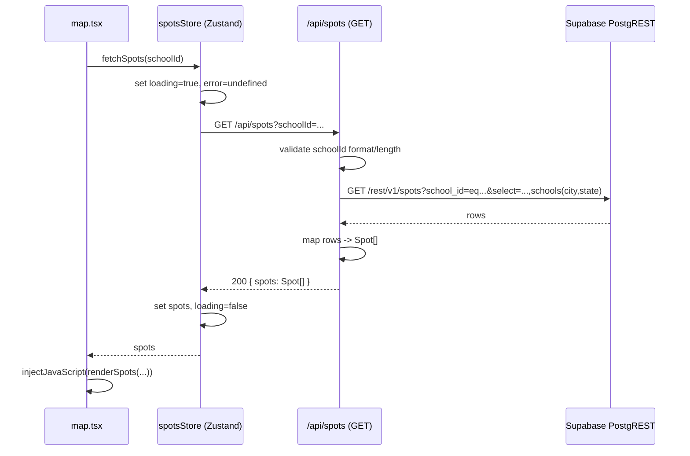
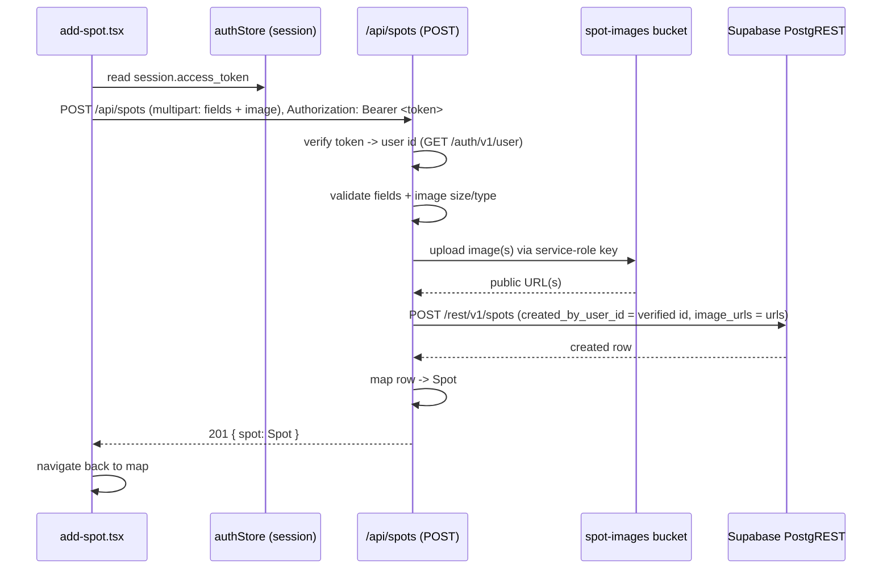

# Design Document

## Overview

This feature moves skate spots from device-local storage (`SpotsContext` + AsyncStorage) into a shared Supabase-backed `public.spots` table, linked to the existing `public.schools` table by `school_id`. All reads and writes go through a new server-side Expo API route (`src/app/api/spots+api.ts`) that mirrors the existing `schools+api.ts` pattern, keeping the Supabase service-role key and the verified user identity on the server. Selected spot images are uploaded to a Supabase Storage bucket through that same route, and the returned public URLs are persisted on the spot record.

On the client, spot state moves from a React context to a Zustand store (`src/store/spotsStore.ts`) that fetches spots per school from the API. The map screen renders spots for the school it is viewing, and the add-spot screen POSTs new spots (with the user's access token) instead of writing to AsyncStorage.

Design goals, per `AGENTS.md`:

- Smallest useful version first. No new major libraries. (Everything here uses libraries already in the project: Supabase, Zustand, Expo Router, `expo-image-picker`, `fetch`.)
- Follow existing patterns exactly: the `schools+api.ts` fetch-to-PostgREST style, the `profiles_setup.sql` migration style, and the existing Zustand stores.
- Strict TypeScript, no `any`.

## Architecture

### Components

| Layer | File | Responsibility |
| --- | --- | --- |
| Database | `supabase/spots_setup.sql` | `spots` table, indexes, `updated_at` trigger, RLS policies. Re-runnable. |
| Storage | `supabase/spots_setup.sql` (bucket note) + Storage bucket `spot-images` | Holds uploaded spot images; public read. |
| Server API | `src/app/api/spots+api.ts` | `GET /api/spots?schoolId=...` and `POST /api/spots`. Validation, auth verification, image upload, PostgREST reads/writes. |
| Client state | `src/store/spotsStore.ts` | Zustand store: fetch spots by school, loading/error state, add spot via API. Replaces `SpotsContext`. |
| Screens | `src/app/map.tsx`, `src/app/add-spot.tsx` | Consume the store; render pins; submit new spots. |
| Types | `src/types/spot.ts` | Strict `Spot` shape shared by API mapping and screens. |

### Data flow — reading spots (map)



### Data flow — creating a spot (add-spot)



The map screen refetches spots for the school on focus (or after returning from add-spot) so a newly created spot appears.

## Components and Interfaces

### Server API — `src/app/api/spots+api.ts`

```ts
// Config + validation helpers (exported for property tests)
function getSupabaseConfig(): { url: string; apiKey: string } | null;
function validateSchoolId(value: string | null): { ok: true; value: string } | { ok: false; message: string };
function validatePostBody(fields: Record<string, string>):
  | { ok: true; value: { schoolId: string; name: string; description: string; latitude: number; longitude: number } }
  | { ok: false; message: string };
function validateImageFile(file: { type: string; size: number }): { ok: true } | { ok: false; message: string };
function buildInsertRecord(
  body: { schoolId: string; name: string; description: string; latitude: number; longitude: number },
  verifiedUserId: string,
  imageUrls: string[]
): DatabaseSpotInsert; // created_by_user_id always = verifiedUserId
function mapSpot(row: DatabaseSpot): Spot;

// Auth + I/O (thin wrappers over fetch)
async function resolveUserId(config, accessToken: string): Promise<string | null>;      // GET /auth/v1/user
async function uploadImages(config, schoolId: string, files: File[]): Promise<string[]>; // ordered, 30s timeout

// Route handlers
export async function GET(request: Request): Promise<Response>;
export async function POST(request: Request): Promise<Response>;
```

### Client store — `src/store/spotsStore.ts`

```ts
export const useSpotsStore = create<SpotsState>()((set, get) => ({ ... }));
// selectors used by screens: spots, loading, error, fetchSpots, addSpot
```

### Screens

- `map.tsx` consumes `spots`, `loading`, `error`, `fetchSpots`; renders pins via the existing `renderSpots` WebView call.
- `add-spot.tsx` consumes `addSpot` + `useAuthStore().session`; manages `saving`/`saveError`.

### Component (unchanged interface)

- `SpotImagePicker` keeps its `onImageSelected(uri: string)` contract; the add-spot screen forwards the uri into the POST payload (Req 7.6).

## Data Models

### Database row — `public.spots` (server-side)

| Column | Type | Notes |
| --- | --- | --- |
| `id` | uuid | PK, default `gen_random_uuid()` |
| `school_id` | uuid | not null, FK → `schools(id)` on delete cascade |
| `created_by_user_id` | uuid | FK → `auth.users(id)`, set server-side |
| `name` | text | not null, 1–100 chars |
| `description` | text | not null, 0–1000 chars |
| `latitude` | double precision | not null, −90..90 |
| `longitude` | double precision | not null, −180..180 |
| `image_urls` | text[] | not null default `{}`, ≤ 10 |
| `created_at` | timestamptz | not null default `now()` |
| `updated_at` | timestamptz | not null default `now()`, trigger-maintained |

### API DTOs (server)

- `DatabaseSpot` — the selected columns plus the embedded `schools(city,state)` object (see API Design). Used only inside the route.
- `DatabaseSpotInsert` — the insert payload: `school_id`, `created_by_user_id`, `name`, `description`, `latitude`, `longitude`, `image_urls`.

### Client models (`src/types/spot.ts`)

- `Spot` — the strict client shape consumed by screens (see Spot Type Changes). `city`/`state` are populated by the API from the joined school; `imageUris` is always an array.
- `NewSpotInput` — the create payload the store sends (no `id`/`imageUris`/`city`/`state`).

The city/state mismatch (present on `Spot`, absent on the table) is resolved by GET/POST embedding `schools(city,state)` via the `school_id` foreign key and mapping them in `mapSpot` — no `any` required.

## Database Schema & Migration

New file: `supabase/spots_setup.sql`. It follows the exact conventions in `supabase/profiles_setup.sql`: `create table if not exists`, `create index if not exists`, a `create or replace function ... security definer set search_path = ''` trigger function, `drop trigger if exists` before `create trigger`, `alter table ... enable row level security`, and `drop policy if exists` before each `create policy`. Safe to re-run.

### Table

```sql
create table if not exists public.spots (
  id                 uuid primary key default gen_random_uuid(),
  school_id          uuid not null references public.schools (id) on delete cascade,
  created_by_user_id uuid references auth.users (id) on delete set null,
  name               text not null check (char_length(name) between 1 and 100),
  description        text not null check (char_length(description) between 0 and 1000),
  latitude           double precision not null check (latitude between -90 and 90),
  longitude          double precision not null check (longitude between -180 and 180),
  image_urls         text[] not null default '{}' check (array_length(image_urls, 1) is null or array_length(image_urls, 1) <= 10),
  created_at         timestamptz not null default now(),
  updated_at         timestamptz not null default now()
);
```

Notes:
- `id` is a generated uuid (Req 1.1). `school_id` is non-null and cascades on school delete (Req 1.2, 1.3).
- `created_by_user_id` references `auth.users(id)` (Req 1.4). `on delete set null` preserves community spots if a user is deleted; ownership checks then simply fail closed.
- Column-level `check` constraints enforce length, coordinate range, and array size; violations reject the write and leave existing data unchanged (Req 1.5–1.9, 1.13).
- `created_at` / `updated_at` default to `now()` and are non-null (Req 1.10, 1.11).

### Indexes

```sql
create index if not exists spots_school_id_idx on public.spots (school_id);
create index if not exists spots_lat_lng_idx on public.spots (latitude, longitude);
```

Single composite index on `(latitude, longitude)` (Req 2.3, 2.4, 2.5).

### `updated_at` trigger

```sql
create or replace function public.set_spots_updated_at()
returns trigger
language plpgsql
security definer
set search_path = ''
as $$
begin
  new.updated_at = now();
  return new;
end;
$$;

drop trigger if exists spots_set_updated_at on public.spots;

create trigger spots_set_updated_at
  before update on public.spots
  for each row execute function public.set_spots_updated_at();
```

Only the updated row's `updated_at` is set, on each update, via a single idempotent trigger (Req 1.12, 2.6, 2.7).

### Row Level Security

```sql
alter table public.spots enable row level security;

drop policy if exists "Spots are publicly readable" on public.spots;
create policy "Spots are publicly readable"
  on public.spots for select using (true);

drop policy if exists "Users can insert own spots" on public.spots;
create policy "Users can insert own spots"
  on public.spots for insert
  with check (auth.uid() = created_by_user_id);

drop policy if exists "Users can update own spots" on public.spots;
create policy "Users can update own spots"
  on public.spots for update
  using (auth.uid() = created_by_user_id)
  with check (auth.uid() = created_by_user_id);

drop policy if exists "Users can delete own spots" on public.spots;
create policy "Users can delete own spots"
  on public.spots for delete
  using (auth.uid() = created_by_user_id);
```

Public select for everyone including anon; owner-only insert/update/delete via `auth.uid()` (Req 3.1–3.8). Each policy is preceded by `drop policy if exists` for idempotency (Req 3.6).

> RLS note on the service-role key: the service-role key bypasses RLS. Because inserts happen server-side with the service-role key, the API route is the trust boundary — it MUST set `created_by_user_id` from the verified token (never from the client body). RLS remains the enforcement layer for any future anon/authenticated-key access path and documents the intended ownership rules.

### Storage bucket

A public Storage bucket named `spot-images` holds uploaded images. Because bucket creation is not part of table DDL, the migration file includes a commented setup block plus a short header comment instructing the operator to create the bucket (public read) in the Supabase dashboard or via the Storage API. Public read lets the client render images by URL; writes happen only server-side with the service-role key.

## API Design

New file: `src/app/api/spots+api.ts`. It reuses the `schools+api.ts` shape: a `getSupabaseConfig()` helper reading `process.env.SUPABASE_URL` and `process.env.SUPABASE_SERVICE_ROLE_KEY ?? process.env.SUPABASE_ANON_KEY`, and `fetch` calls to `${url}/rest/v1/spots` with `apikey` + `Authorization: Bearer` headers.

### Shared types & helpers

```ts
type DatabaseSpot = {
  id: string;
  school_id: string;
  name: string;
  description: string;
  latitude: number;
  longitude: number;
  image_urls: string[];
  schools: { city: string; state: string } | null; // embedded via PostgREST
};

const SPOT_ID_PATTERN = /^[A-Za-z0-9_-]+$/;      // mirrors schools+api.ts
const MAX_SCHOOL_ID_LENGTH = 64;
const NAME_MAX = 100;
const DESCRIPTION_MAX = 1000;
const MAX_IMAGES = 10;
const MAX_IMAGE_BYTES = 10 * 1024 * 1024;         // 10 MB
const UPLOAD_TIMEOUT_MS = 30_000;
const ALLOWED_IMAGE_TYPES = ['image/jpeg', 'image/png', 'image/webp'] as const;
```

### city / state mismatch resolution

The client `Spot` type carries `city` and `state`, but `spots` does not store them — they belong to the school. GET resolves them by PostgREST resource embedding on the `school_id` foreign key:

```
select=id,school_id,name,description,latitude,longitude,image_urls,schools(city,state)
```

`mapSpot` reads `row.schools?.city ?? ''` and `row.schools?.state ?? ''`. This populates every required client field without `any` and satisfies the Req 4.6 / 5.7 mapping. On POST, the created row is re-read (or the request also embeds `schools(city,state)` via `Prefer: return=representation` + `select`) so the returned Spot includes city/state.

```ts
function mapSpot(row: DatabaseSpot): Spot {
  return {
    id: row.id,
    name: row.name,
    description: row.description,
    latitude: row.latitude,
    longitude: row.longitude,
    imageUris: row.image_urls ?? [],
    city: row.schools?.city ?? '',
    state: row.schools?.state ?? '',
    schoolId: row.school_id,
  };
}
```

### GET /api/spots

Request: query parameter `schoolId` (required).

| Condition | Status | Body |
| --- | --- | --- |
| Valid `schoolId`, matches rows | 200 | `{ spots: Spot[] }` |
| Valid `schoolId`, no rows | 200 | `{ spots: [] }` |
| Missing `schoolId` | 400 | `{ error: 'The schoolId parameter is required.' }` |
| `schoolId` fails `^[A-Za-z0-9_-]+$` or > 64 chars | 400 | `{ error: 'The schoolId parameter is invalid.' }` |
| Supabase not configured | 500 | `{ error: 'Spots database is not configured.' }` |
| Supabase request fails | 500 | `{ error: 'Unable to load spots right now...' }` |

(Req 4.1–4.8, 7.* n/a.) PostgREST query: `GET ${url}/rest/v1/spots?school_id=eq.<id>&select=<cols with embed>&order=created_at.asc`.

### POST /api/spots

Requires `Authorization: Bearer <access_token>`. Body is `multipart/form-data` (see Image Upload Design) with text fields `schoolId`, `name`, `description`, `latitude`, `longitude`, and zero-or-more `image` file parts.

Processing order (fail-fast, so no orphan data is created):

1. **Auth** — read bearer token; if absent → 401 `authentication is required`. Verify via `GET ${url}/auth/v1/user` with `apikey: <config key>` and `Authorization: Bearer <user token>`. Non-200 → 401 (`token is invalid` / `token is expired` based on the auth response). Resolve `created_by_user_id` from the returned user `id`. Any client-supplied user id field is ignored (Req 6.1–6.6).
2. **Parse body** — `await request.formData()`. If parsing fails → 400 `malformed`. (Req 5.6)
3. **Validate fields** — required/non-empty (trimmed) `schoolId`, `name`, `description`; `name` ≤ 100; `description` ≤ 1000; `latitude` numeric in [-90, 90]; `longitude` numeric in [-180, 180]. First failing field → 400 with a message naming it (Req 5.3–5.5).
4. **Validate images** — each ≤ 10 MB and type in {JPEG, PNG, WEBP}; count ≤ 10. Otherwise → 400 naming size/format (Req 7.1, 7.2).
5. **Upload images** — server-side, service-role key, 30s timeout (see below). Any failure/timeout → 500, no record inserted, no URLs persisted (Req 7.5).
6. **Insert** — `POST ${url}/rest/v1/spots` with `Prefer: return=representation`, body `{ school_id, created_by_user_id, name, description, latitude, longitude, image_urls }`. Insert failure → 500 `insert failed`, no partial Spot returned (Req 5.8).
7. **Respond** — 201 `{ spot: Spot }` mapped via `mapSpot` (Req 5.2, 5.7).

Status codes summary: 201 created; 400 validation/malformed/image; 401 auth; 500 config/upload/insert failure.

## Image Upload Design

### Client → server transport

`SpotImagePicker` already returns a single local image `uri` via `onImageSelected`. The add-spot screen builds a `FormData` and appends the image using the React Native file form `{ uri, name, type }`, which RN serializes as a multipart file part. This avoids base64 inflation and keeps memory low for the 10 MB limit.

```ts
const form = new FormData();
form.append('schoolId', schoolId);
form.append('name', name.trim());
form.append('description', description.trim());
form.append('latitude', String(latitude));
form.append('longitude', String(longitude));
// React Native multipart file part
form.append('image', {
  uri: imageUri,
  name: 'spot.jpg',
  type: 'image/jpeg',
} as unknown as Blob); // RN FormData file shape; typed via a small helper, no `any`
```

The design uses a tiny typed helper (e.g. `type RNFile = { uri: string; name: string; type: string }`) so the file part is typed without `any` or `as any`. `Content-Type` is left unset so the runtime adds the correct multipart boundary. The store/screen supports one image today (matching `SpotImagePicker`) but the server accepts up to 10 `image` parts for future multi-image support.

### Server upload

The route reads file parts from `request.formData()` (each is a `File`/`Blob` with `.type`, `.size`, and `.arrayBuffer()`). For each file, in selection order:

1. Validate `size <= MAX_IMAGE_BYTES` and `type` in `ALLOWED_IMAGE_TYPES`.
2. Build an object key: `${schoolId}/${crypto.randomUUID()}.${ext}` where `ext` is derived from the content type. Random names avoid collisions and path traversal.
3. Upload via the Storage REST endpoint using the service-role key, guarded by a 30s timeout (`AbortController` + `setTimeout`):

   ```
   POST ${url}/storage/v1/object/spot-images/${objectKey}
   headers: { apikey, Authorization: Bearer <service key>, 'Content-Type': file.type }
   body: <file bytes>
   ```
4. On success, derive the public URL: `${url}/storage/v1/object/public/spot-images/${objectKey}` and collect it, preserving order (Req 7.3).

If any single upload fails or exceeds 30s, the route aborts, returns 500, and does not insert the spot — so no `image_urls` are persisted and no orphan record exists (Req 7.5). (Uploaded blobs from a failed batch are best-effort; because no DB row references them they are unreferenced, and cleanup can be handled by a later Storage lifecycle rule; the correctness requirement is that no URL is persisted on a record.)

The service-role key stays server-side only (Req 7.4, 5.9).

## Client State (Zustand `spotsStore`) Design

New file: `src/store/spotsStore.ts`, following the plain-`create` pattern of `schoolsStore.ts` (no persistence — Req 9.1, 9.7). `SpotsContext` is removed and its consumers switch to this store.

```ts
type SpotsState = {
  spots: Spot[];
  loading: boolean;
  error: string | null;
  schoolId: string | null;          // the school the current spots belong to
  fetchSpots: (schoolId: string) => Promise<void>;
  addSpot: (input: NewSpotInput, accessToken: string) => Promise<Spot>;
  reset: () => void;
};
```

Behavior:

- `fetchSpots(schoolId)`:
  - If `schoolId` is missing/empty → do not call the API; set `error` to an invalid-identifier message, leave `spots` unchanged (Req 9.6).
  - Else set `loading=true`, `error=null`; `fetch('/api/spots?schoolId=...')` with a 10s timeout via `AbortController` (Req 9.2).
  - On success → set `spots` to the mapped list (may be empty with no error — Req 9.5), `schoolId`, `loading=false` (loading cleared well within 100 ms of completion — Req 9.3).
  - On failure/timeout → set `error`, keep previous `spots` unchanged, `loading=false` (Req 9.4).
- `addSpot(input, accessToken)`: builds the `FormData`, POSTs to `/api/spots` with `Authorization: Bearer <accessToken>` and a 10s timeout; on 201 returns the created `Spot`. It does not write to AsyncStorage (Req 10.5). The screen decides navigation/refetch. (Kept in the store so screens stay thin, matching the project's store-centric architecture.)

The store never persists backend spots to AsyncStorage (Req 9.7).

## Screen Integration

### `map.tsx`

- Replace `import { useSpots } from '../context/SpotsContext'` with `useSpotsStore` selectors: `spots`, `loading`, `error`, `fetchSpots`.
- On mount and whenever `schoolId` changes (and on screen focus after returning from add-spot), call `fetchSpots(schoolId)`.
- Marker rendering is unchanged: `sendMarkers()` still maps `spots` to `{ id, latitude, longitude, name }` and calls `injectJavaScript(window.renderSpots(...))`. One pin per record (Req 9.8).
- Optionally surface `loading`/`error` with existing lightweight UI (non-blocking); the map still renders. Selected-spot bottom sheet is unchanged and continues to read from `spots`.

### `add-spot.tsx`

- Remove local id generation, the `Spot` object build, and `useSpots().addSpot` (AsyncStorage path). Remove the `city: ''`/`state: ''` placeholders.
- Add state: `saving: boolean`, `saveError: string | null`.
- `isFormValid` stays: selected image + trimmed name (1–100) + trimmed description (1–1000) (Req 10.1, 10.2). The Save button is disabled when invalid or while `saving` (Req 10.7).
- Read `session` from `useAuthStore`. On save:
  - If no `session?.access_token` → show authentication-required error, do not POST (Req 10.8).
  - Set `saving=true`; call `spotsStore.addSpot(input, accessToken)` (10s timeout — Req 10.3).
  - On success → `router.back()` to the map (Req 10.4). Map refetches on focus so the new spot appears.
  - On failure/timeout/rejection → set `saveError`, keep entered form data, stay on screen, `saving=false` (Req 10.6).
- Show an in-progress indicator on the Save button while `saving` (Req 10.7). No AsyncStorage writes (Req 10.5).

## Spot Type Changes

`src/types/spot.ts` stays strict and reconciles city/state. City/state are not stored on `spots`; they are populated by the API from the joined school. The client shape keeps them as required strings (the API always provides them, defaulting to `''` when the embed is missing), so screens compile unchanged.

```ts
export type Spot = {
  id: string;
  name: string;
  description: string;
  latitude: number;
  longitude: number;
  imageUris: string[]; // empty array when no images, never undefined/null
  city: string;        // populated by API from the joined school
  state: string;       // populated by API from the joined school
  schoolId?: string;   // optional
};
```

A separate `NewSpotInput` type (no `id`/`imageUris`/city/state) describes the create payload the store sends:

```ts
export type NewSpotInput = {
  schoolId: string;
  name: string;
  description: string;
  latitude: number;
  longitude: number;
  imageUri?: string; // single local uri from SpotImagePicker (today)
};
```

No `any`, no `as any`; required fields keep explicit types so strict-mode misuse fails compilation (Req 8.1–8.5).

## Correctness Properties

*A property is a characteristic or behavior that should hold true across all valid executions of a system — essentially, a formal statement about what the system should do. Properties serve as the bridge between human-readable specifications and machine-verifiable correctness guarantees.*

These properties apply to the pure, input-varying logic of this feature: the API validation helpers, the row→Spot mapping, ownership resolution, image validation/ordering, and the store's state invariants. The SQL migration, RLS policies, and external I/O (auth verification, PostgREST, Storage) are covered by integration/smoke and example tests instead (see Testing Strategy). The list below is the deduplicated set from the prework.

### Property 1: schoolId validation accepts valid ids and rejects invalid ones

*For any* string, the `schoolId` validator accepts it if and only if it matches `^[A-Za-z0-9_-]+$` and its length is between 1 and 64 inclusive; the GET handler returns 400 for every rejected id (including a missing id) and proceeds for every accepted id.

**Validates: Requirements 4.2, 4.4, 4.5**

### Property 2: row→Spot mapping populates every required field

*For any* database spot row (with the school embed present or absent, and with an empty or non-empty `image_urls`), `mapSpot` produces a `Spot` in which `id`, `name`, `description` are strings, `latitude`/`longitude` are numbers, `imageUris` is an array (empty when no images, never `undefined`/`null`), and `city`/`state` are strings. This holds for rows returned by GET and for the created row returned by POST.

**Validates: Requirements 4.6, 5.7, 8.4**

### Property 3: POST body validation enforces required fields, lengths, and coordinate ranges

*For any* candidate POST body, validation succeeds if and only if `schoolId` is a non-empty (trimmed) string, `name` is a trimmed string of length 1–100, `description` is a trimmed string of length 1–1000, `latitude` is a number in [-90, 90], and `longitude` is a number in [-180, 180]; any body violating one of these is rejected with a 400 whose message identifies the offending field (missing/empty, length limit, or invalid coordinate).

**Validates: Requirements 5.2, 5.3, 5.4, 5.5**

### Property 4: created_by_user_id is always the verified user, never the client value

*For any* POST body — including one that supplies its own `created_by_user_id`, `userId`, or similar field — the insert record built by the route sets `created_by_user_id` to the id resolved from the verified access token and never to any client-supplied value.

**Validates: Requirements 6.5, 6.6**

### Property 5: image file validation

*For any* image file descriptor, the validator accepts it if and only if its size is at most 10 MB and its content type is one of JPEG, PNG, or WEBP; any rejected file causes a 400 and no spot record is created.

**Validates: Requirements 7.2**

### Property 6: uploaded image URLs preserve selection order

*For any* list of 1–10 images that all upload successfully, the resulting `image_urls` array contains one URL per image in the same order the images were provided.

**Validates: Requirements 7.3**

### Property 7: a failed fetch preserves previously loaded spots

*For any* prior store state and any fetch that fails or times out, the store sets an error, sets loading to false, and leaves the previously loaded `spots` collection unchanged.

**Validates: Requirements 9.4**

### Property 8: blank schoolId is rejected without a fetch

*For any* missing, empty, or whitespace-only `schoolId`, the store does not initiate an API request and exposes an invalid-identifier error.

**Validates: Requirements 9.6**

### Property 9: add-spot save enablement matches the validity predicate

*For any* add-spot form state, the save action is enabled if and only if an image is selected, the trimmed name has length 1–100, and the trimmed description has length 1–1000.

**Validates: Requirements 10.1, 10.2**

## Error Handling

- **GET validation** — missing `schoolId` → 400 (required); malformed/oversized `schoolId` → 400 (invalid). No database call is made for invalid input.
- **POST validation** — malformed multipart/JSON → 400 (malformed); missing/empty field → 400 naming the field; over-length → 400 naming the limit; bad coordinate → 400 naming the coordinate; invalid image size/type → 400 naming size/format. All validation runs before any upload or insert, so a rejected request creates nothing.
- **Auth** — missing bearer → 401 (authentication required); invalid → 401 (invalid); expired → 401 (expired). Determined from the `/auth/v1/user` response. No insert occurs.
- **Configuration** — missing `SUPABASE_URL`/key → 500 (not configured), matching `schools+api.ts`.
- **Upstream failures** — PostgREST read failure → 500 (unable to load); image upload failure/timeout (30s) → 500 (upload failed) with no record and no persisted URLs; insert failure → 500 (insert failed) with no partial Spot.
- **Client store** — fetch failure/timeout (10s) → `error` set, prior `spots` retained, `loading=false`. Errors are surfaced to the map non-destructively (the map still renders existing pins).
- **Add-spot screen** — save failure/timeout/rejection → error message shown, form data retained, stays on screen; missing token → auth-required error, no request sent.
- All server handlers wrap upstream calls in `try/catch`, log server-side (`console.error`), and return a safe message — never leaking the service-role key or raw internals.

## Security Considerations

- **Service-role key stays server-side.** Only `spots+api.ts` reads `SUPABASE_SERVICE_ROLE_KEY` (via `getSupabaseConfig`, mirroring `schools+api.ts`). It is never bundled into client code and never included in any response body (Req 5.9, 7.4). `src/lib/supabase.ts` continues to use only the public anon key.
- **Server-verified ownership.** `created_by_user_id` is derived from the verified access token, not the request body; any client-supplied id is ignored (Req 6.5, 6.6). This is the real trust boundary because the service-role key bypasses RLS.
- **Token verification.** The route verifies the bearer token against Supabase auth before any write; missing/invalid/expired tokens are rejected with 401 (Req 6.1–6.4).
- **RLS defense in depth.** Public read; owner-only insert/update/delete enforced by policies keyed on `auth.uid()` (Req 3.*), documenting intent and protecting any non-service-role access path.
- **Input sanitization.** `schoolId` is constrained to `^[A-Za-z0-9_-]+$` and ≤ 64 chars before use; storage object keys use random UUIDs (no client-controlled paths), preventing path traversal.
- **Upload limits.** 10 MB size cap, allowlisted content types (JPEG/PNG/WEBP), max 10 images, and a 30s timeout bound resource usage and reject abuse.
- **Storage bucket** is public-read only; writes require the server key.

## Testing Strategy

Dual approach: property-based tests for pure logic; example/integration/smoke tests for I/O, flows, and infrastructure.

### Fast-check property tests

- Library: **fast-check** (works with the project's test runner; no new major runtime dependency — it is a dev-only testing library). If it is not already present, its addition should be confirmed before install per `AGENTS.md`.
- Each property test runs **≥ 100 iterations**.
- Each test is tagged with a comment: **Feature: global-spots, Property {number}: {property text}**.
- One property-based test per correctness property (Properties 1–9). Pure helpers (`validateSchoolId`, `mapSpot`, `validatePostBody`, `buildInsertRecord`, `validateImageFile`, order-preserving upload collector, form-validity predicate) are exported so they can be exercised directly; store properties (7, 8) run against the Zustand store with `fetch` mocked.

### Example / edge-case unit tests (with mocks)

- GET: empty result → 200 `{ spots: [] }` (4.3); missing config → 500 (4.7); failing fetch → 500 (4.8).
- POST: malformed body → 400 (5.6); missing/invalid/expired token → 401 (6.1–6.4); insert failure → 500 no partial (5.8); service-role key absent from responses (5.9).
- Images: upload before insert (7.1); single upload failure/timeout → 500, no record, no URLs (7.5); `SpotImagePicker` calls `onImageSelected` (7.6).
- Store: loading transitions and 10s timeout (9.2, 9.3); zero records → empty, no error (9.5); no AsyncStorage persistence (9.7); one pin per record via `renderSpots` (9.8).
- Add-spot: posts with token and navigates back on success (10.3, 10.4); no AsyncStorage write (10.5); failure keeps form + shows error (10.6); in-progress disables save (10.7); no token → auth error, no POST (10.8).

### Integration tests (Supabase, few examples)

- Apply `spots_setup.sql` to a test project: valid insert succeeds; constraint violations (length, coordinate range, non-null, array size, bad FK) are rejected (1.5–1.9, 1.13); `on delete cascade` removes spots when a school is deleted (1.3); `updated_at` trigger updates only the changed row (1.12, 2.6).
- RLS: anon can select; authenticated user can insert only with matching `created_by_user_id`; non-owner update/delete rejected (3.2–3.8).

### Smoke tests

- Re-run `spots_setup.sql` twice → no error, exactly one table and one `updated_at` trigger, indexes present (2.1, 2.2, 2.5, 2.7, 3.1).
- Uploads use the server key and the route is server-only (7.4).

### Type-check gate

- After implementation, run `npx tsc --noEmit`; it must report zero errors and the changed files must contain no `any`/`as any` (Req 11.1–11.4). This is run per `AGENTS.md` at the end of implementation.

## Requirements Traceability

| Requirement | Design element(s) |
| --- | --- |
| 1. Global Spots schema | Database Schema & Migration → Table (columns, checks, defaults) |
| 2. Spots migration file | Database Schema & Migration → file conventions, Indexes, `updated_at` trigger (idempotent) |
| 3. Row Level Security | Database Schema & Migration → Row Level Security policies |
| 4. Read Spots API | API Design → GET /api/spots; city/state embed resolution; `mapSpot` (Property 1, 2) |
| 5. Create Spot API | API Design → POST /api/spots processing steps; `mapSpot` (Property 3, 2) |
| 6. Server-verified ownership | API Design → POST step 1 (auth) + step 6 (insert); Security (Property 4) |
| 7. Spot image upload | Image Upload Design (transport + server upload, order, timeout) (Property 5, 6) |
| 8. Spot type definition | Spot Type Changes (strict `Spot`, `NewSpotInput`) (Property 2) |
| 9. Client spot state via Zustand | Client State (spotsStore) Design (Property 7, 8) |
| 10. Add spot flow persists to backend | Screen Integration → add-spot.tsx (Property 9) |
| 11. Type-check verification | Testing Strategy → Type-check gate |
